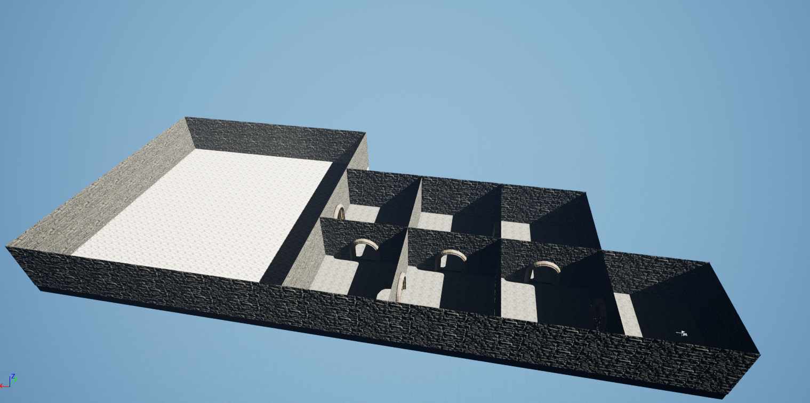

# Report "Excalibur"
## Vorarbeit
Suche nach passendem Asset wurde abgeschlossen. Für das Projekt Excalibur wird vorwiegend das Asset "Medival Dungeon" (https://www.unrealengine.com/marketplace/en-US/product/a5b6a73fea5340bda9b8ac33d877c9e2) verwendet.
Da das Asset nur die Unreal Versionen 4.21.-4.26. verwendet, wurde zunächst ein Projekt in Version 4.36. erstellt und dieses dann auf 5.1. geupgraded.
Als Dokumentationsverwaltung und zentrale Kooperationsplattform wird GIT verwendet.
Liste an Rätsel wurde erweitert 

## Implementierung
Layout der Räume abgeschlossen => hierfür wurde eine möglichst platzsparende Art der Raumanordnung gewählt 
1

## Nächste Aufgaben
- Implementierung der Türverriegelung, kann in Zukunft wiederverwendet wiederverwendet
- Implementierung erster Rätsel
- Erweiterung und Kombination der Rätselelemente
 