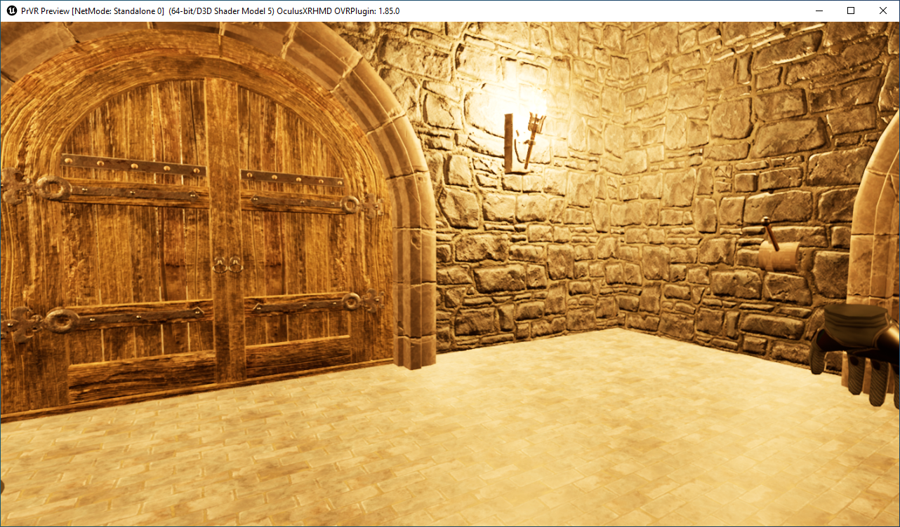
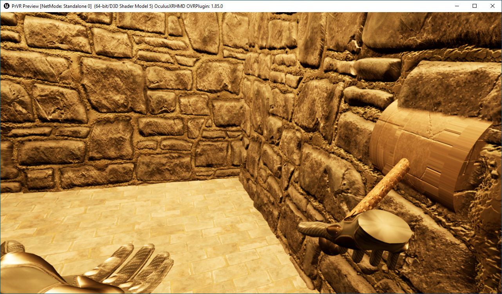
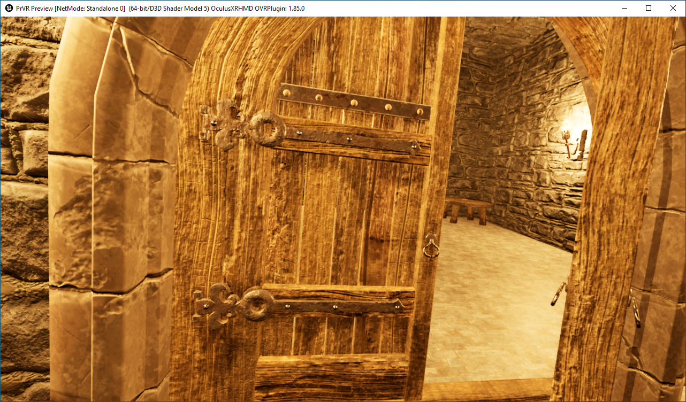

# Report Excalibut
## Geplante Wochenziele:
- Interaktion Tür perfektionieren und mit Rätseln kombinieren, so dass die Tür erst nach dem Lösen des Rätsels geöffnet werden kann.
- Basic Rätsel Elemente implementieren: Hebel, Schlüssel, Knöpfe, Bruchstücke zum zusamensetzen

## Implementierte Elemente
- Verbesserung des Characters: Hände statt Controller ingame, Animationen der Hände verbessert, Bewegung mit Joystick verbessert, reduzierung der genutzen Trigger des Controlers auf Schultertaste zum interagieren und Joystick zum bewegen
- Tür kann nun vollständig mit Rätselelemente kombiniert werden:

- Implementierung Schlüssel Schloss begonnen
- Implementierung Knöpfe begonnen

## Plan für nächste Woche
- Implementierung der Rätselelemente fertigstellen
- Rätsel fertig implementieren
- GUI fertigstellen
- Ziel: Vollständig Spielbare Version 

## Änderungen des TechDocs
- Keine Teleportation mehr vorgesehen. Bewegung rein über Controller und freies Bewegen des Spielers.
