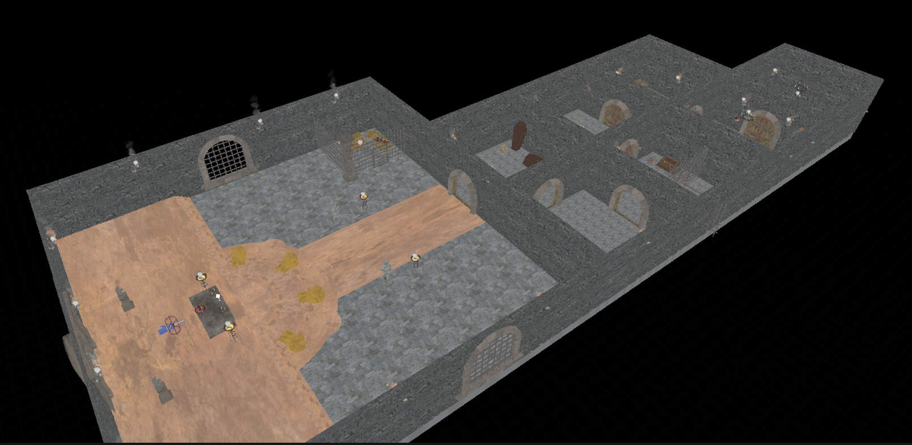
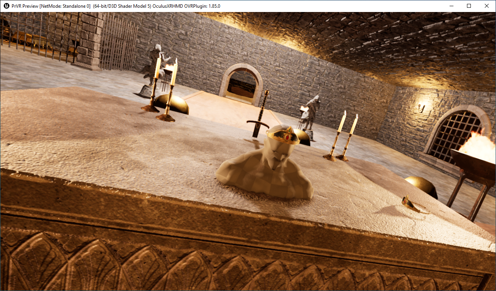

# Report Excalibur
## Geplante Wochenziele:
- Basic Rätsel Elemente implementieren: Schlüssel, Knöpfe, Bruchstücke zum zusamensetzen
- Rätsel fertig implementieren
- GUI fertigstellen
- Ambiente verbssern

## Implementierte Elemente

- Fertigstellung der Räume mit Dekoration und Rätsel
- Implementierung GUI fertiggestellt, Startscreen, Pausescreen und Endscreen
- Implementierung Schlüssel Schloss fertiggestellt
- Implementierung Knöpfe fertiggestellt
- Implementierung Bruchstücke begonnen

## Plan für nächste Woche
- Verbesserung der Interaktionen
- Musik einbinden
- Letztes Bugfixing
- Paketieren

